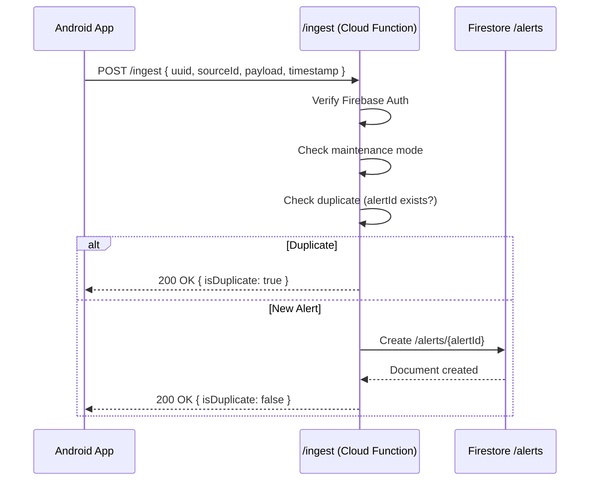

# FIRESTORE CRM WRITE FLOW (CANONICAL)

**Schema Version:** 1.0.0  
**Last Updated:** December 23, 2025  
**Status:** 🔒 **LOCKED** (Immutable Infrastructure)

---

## 🎯 **OBJECTIVE**

Document the **canonical write and enrichment flow** for the address-centric CRM, from alert ingestion to contact discovery.

---

## 📊 **COLLECTIONS (LOCKED SCHEMA)**

### **1️⃣ /alerts (Append-Only Event Log)**

**Purpose:** Raw event storage, immutable record of every alert received.

**Document ID:** `alertId` (UUID from client)

**Schema:**
```typescript
{
  alertId: string;              // UUID (from client)
  sourceId: string;             // Source that captured this
  rawPayload: object;           // Original JSON payload
  rawAddress: string | null;    // Extracted address (if any)
  eventTimestamp: number;       // Unix millis (from client)
  
  // Metadata
  clientUserId: string;         // Firebase Auth UID
  clientDeviceId: string;       // Android device ID
  clientAppVersion: string;     // App version
  
  // Status
  ingestionStatus: "INGESTED";
  ingestedAt: Timestamp;        // Server timestamp
  enrichmentStatus: string;     // "PENDING" | "PROPERTY_LINKED" | "NO_ADDRESS" | "GEOCODED" | ...
  
  // CRM Linkage (set by enrichAlert function)
  propertyId: string | null;    // Hash of normalized address
  normalizedAddress: string | null; // Cleaned address string
  
  // Future
  deliveryStatus: string;       // For server-side fanout
  deliveredAt: Timestamp | null;
}
```

**Indexes:**
```json
[
  { "fields": ["propertyId", "ingestedAt DESC"] },
  { "fields": ["clientUserId", "ingestedAt DESC"] },
  { "fields": ["sourceId", "ingestedAt DESC"] }
]
```

**Security Rules:**
```
- Client: CAN create (append-only)
- Client: CANNOT update/delete
- Server: CAN update propertyId, normalizedAddress, enrichmentStatus
```

---

### **2️⃣ /properties (Property Master Records)**

**Purpose:** One canonical record per physical address, aggregates all alerts for that address.

**Document ID:** `propertyId` (SHA-256 hash of normalized address, first 16 chars)

**Schema:**
```typescript
{
  propertyId: string;           // Deterministic hash
  normalizedAddress: string;    // Cleaned address
  rawAddress: string;           // First seen raw address
  
  // Aggregates
  alertCount: number;           // Total alerts received
  lastAlertTimestamp: number;   // Most recent alert
  
  // Geocoding
  lat: number | null;
  lng: number | null;
  geocodeProvider: string | null; // "google" | "mapbox" | ...
  geocodeConfidence: string | null; // "rooftop" | "street" | ...
  
  // Ownership
  ownerName: string | null;
  ownerProvider: string | null; // "attom" | ...
  
  // Contacts
  contactEmails: string[];
  contactPhones: string[];
  contactProvider: string | null;
  
  // Status
  enrichmentStatus: string;     // "PENDING_GEOCODE" | "GEOCODED" | "OWNER_LOOKED_UP" | ...
  createdAt: Timestamp;
  updatedAt: Timestamp;
}
```

**Indexes:**
```json
[
  { "fields": ["lastAlertTimestamp DESC", "createdAt DESC"] },
  { "fields": ["normalizedAddress"] }
]
```

**Security Rules:**
```
- Client: CANNOT write
- Server: CAN create/update via Cloud Functions
```

---

### **3️⃣ /people (Owner/Occupant Records)**

**Purpose:** Individual persons associated with properties.

**Document ID:** `personId` (auto-generated or provider ID)

**Schema:**
```typescript
{
  personId: string;
  fullName: string;
  firstName: string | null;
  lastName: string | null;
  propertyId: string;           // Link to property
  role: string;                 // "owner" | "occupant" | "tenant"
  source: string;               // "attom" | "manual" | ...
  createdAt: Timestamp;
  updatedAt: Timestamp;
}
```

**Indexes:**
```json
[
  { "fields": ["propertyId", "createdAt DESC"] },
  { "fields": ["fullName"] }
]
```

---

### **4️⃣ /contacts (Phone/Email Records)**

**Purpose:** Contact methods for people.

**Document ID:** `contactId` (auto-generated)

**Schema:**
```typescript
{
  contactId: string;
  personId: string;             // Link to person
  type: "email" | "phone";
  value: string;                // Email address or phone number
  isPrimary: boolean;
  isVerified: boolean;
  source: string;               // Provider or "manual"
  createdAt: Timestamp;
  updatedAt: Timestamp;
}
```

**Indexes:**
```json
[
  { "fields": ["personId", "type"] },
  { "fields": ["value"] }
]
```

---

### **5️⃣ /households (Property-People Grouping)**

**Purpose:** Group multiple people at the same property.

**Document ID:** `householdId` (auto-generated or propertyId-based)

**Schema:**
```typescript
{
  householdId: string;
  propertyId: string;
  personIds: string[];
  householdType: string;        // "single" | "family" | "multi-tenant"
  createdAt: Timestamp;
  updatedAt: Timestamp;
}
```

---

### **6️⃣ /enrichments (Provider Audit Trail)**

**Purpose:** Store raw provider responses for debugging and compliance.

**Document ID:** `enrichmentId` (auto-generated)

**Schema:**
```typescript
{
  enrichmentId: string;
  propertyId: string;
  provider: string;             // "google_geocode" | "attom" | ...
  requestType: string;          // "geocode" | "owner_lookup" | ...
  requestPayload: object;
  responsePayload: object;
  responseStatus: string;       // "success" | "error" | "rate_limited"
  createdAt: Timestamp;
}
```

**Indexes:**
```json
[
  { "fields": ["propertyId", "provider", "createdAt DESC"] }
]
```

---

### **7️⃣ /outreaches (Campaign Execution Log)**

**Purpose:** Track email/SMS campaigns sent to contacts.

**Document ID:** `outreachId` (auto-generated)

**Schema:**
```typescript
{
  outreachId: string;
  contactId: string;
  campaignId: string;
  channel: "email" | "sms";
  status: string;               // "pending" | "sent" | "delivered" | "bounced" | "clicked"
  sentAt: Timestamp | null;
  deliveredAt: Timestamp | null;
  createdAt: Timestamp;
}
```

---

### **8️⃣ /messages (Message Content & Delivery)**

**Purpose:** Store actual message content and provider responses.

**Document ID:** `messageId` (auto-generated)

**Schema:**
```typescript
{
  messageId: string;
  outreachId: string;
  channel: "email" | "sms";
  subject: string | null;       // Email only
  body: string;
  providerMessageId: string | null; // Twilio/SendGrid ID
  providerResponse: object | null;
  createdAt: Timestamp;
}
```

---

### **9️⃣ /config/featureFlags (Kill Switches)**

**Purpose:** Control enrichment pipeline behavior without redeployment.

**Document ID:** `featureFlags` (singleton)

**Schema:**
```typescript
{
  maintenanceMode: boolean;
  firestoreIngest: boolean;
  alertEnrichment: boolean;
  geocoding: boolean;
  propertyEnrichment: boolean;
  contactEnrichment: boolean;
  crmWrites: boolean;
  appsScriptDelivery: boolean;
  firestoreFanout: boolean;
  maxAlertsPerMinute: number;
  maxEnrichmentsPerHour: number;
}
```

---

## 🔄 **WRITE FLOW (STEP-BY-STEP)**

### **Phase 1: Alert Ingestion (Client → Server)**



**Code:** `functions/src/index.ts` → `ingest` function

**Trigger:** HTTP POST from Android `IngestQueue.enqueue()`

**Writes:**
- `/alerts/{alertId}` (append-only)

**Status:** ✅ DEPLOYED

---

### **Phase 2: Address Extraction & Property Linking (Server)**

```mermaid
sequenceDiagram
    participant Firestore as Firestore /alerts
    participant EnrichAlert as enrichAlert (Cloud Function)
    participant Utils as addressUtils
    participant Properties as Firestore /properties
    
    Firestore->>EnrichAlert: onCreate trigger (new /alerts doc)
    EnrichAlert->>EnrichAlert: Check feature flag (alertEnrichment)
    EnrichAlert->>Utils: extractAddressFromPayload(rawPayload)
    Utils-->>EnrichAlert: rawAddress (or null)
    alt No Address
        EnrichAlert->>Firestore: Update alert { enrichmentStatus: "NO_ADDRESS" }
    else Has Address
        EnrichAlert->>Utils: normalizeAddress(rawAddress)
        Utils-->>EnrichAlert: normalizedAddress
        EnrichAlert->>Utils: generatePropertyId(normalizedAddress)
        Utils-->>EnrichAlert: propertyId (SHA-256 hash)
        EnrichAlert->>Properties: Create/update /properties/{propertyId}
        EnrichAlert->>Firestore: Update alert { propertyId, normalizedAddress, enrichmentStatus: "PROPERTY_LINKED" }
    end
```

**Code:** `functions/src/enrichment.ts` → `enrichAlert` function

**Trigger:** Firestore onCreate `/alerts/{alertId}`

**Writes:**
- `/alerts/{alertId}` (update propertyId, normalizedAddress)
- `/properties/{propertyId}` (create or update)

**Status:** ✅ DEPLOYED

---

### **Phase 3: Geocoding (Gated, Server)**

```mermaid
sequenceDiagram
    participant Properties as Firestore /properties
    participant EnrichProperty as enrichProperty (Cloud Function)
    participant Geocode as Geocoding API (Google/Mapbox)
    
    Properties->>EnrichProperty: onWrite trigger (new/updated property)
    EnrichProperty->>EnrichProperty: Check feature flag (geocoding)
    alt Geocoding OFF
        EnrichProperty-->>Properties: Skip
    else Geocoding ON
        EnrichProperty->>Geocode: POST { address: normalizedAddress }
        Geocode-->>EnrichProperty: { lat, lng, confidence }
        EnrichProperty->>Properties: Update { lat, lng, geocodeProvider, enrichmentStatus: "GEOCODED" }
    end
```

**Code:** `functions/src/enrichment.ts` → `enrichProperty` function (geocoding block)

**Trigger:** Firestore onWrite `/properties/{propertyId}`

**Writes:**
- `/properties/{propertyId}` (update lat, lng, geocodeProvider)
- `/enrichments/{enrichmentId}` (audit trail)

**Status:** ⚠️ STUBBED (placeholder, API call commented out)

---

### **Phase 4: Owner Lookup (Gated, Server)**

```mermaid
sequenceDiagram
    participant Properties as Firestore /properties
    participant EnrichProperty as enrichProperty (Cloud Function)
    participant ATTOM as ATTOM API
    
    Properties->>EnrichProperty: onWrite trigger
    EnrichProperty->>EnrichProperty: Check feature flag (propertyEnrichment)
    EnrichProperty->>EnrichProperty: Has geocode? (lat/lng exist?)
    alt No Geocode
        EnrichProperty-->>Properties: Skip (geocode first)
    else Has Geocode
        EnrichProperty->>ATTOM: POST { lat, lng }
        ATTOM-->>EnrichProperty: { ownerName, parcelId, ... }
        EnrichProperty->>Properties: Update { ownerName, ownerProvider }
    end
```

**Code:** `functions/src/enrichment.ts` → `enrichProperty` function (owner lookup block)

**Trigger:** Firestore onWrite `/properties/{propertyId}`

**Writes:**
- `/properties/{propertyId}` (update ownerName)
- `/enrichments/{enrichmentId}` (audit trail)

**Status:** ⚠️ STUBBED (placeholder, API call commented out)

---

### **Phase 5: Contact Discovery (Gated, Server)**

```mermaid
sequenceDiagram
    participant Properties as Firestore /properties
    participant EnrichProperty as enrichProperty (Cloud Function)
    participant ContactAPI as Contact Provider
    participant People as Firestore /people
    participant Contacts as Firestore /contacts
    
    Properties->>EnrichProperty: onWrite trigger
    EnrichProperty->>EnrichProperty: Check feature flag (contactEnrichment)
    EnrichProperty->>EnrichProperty: Has owner name?
    alt No Owner
        EnrichProperty-->>Properties: Skip (owner lookup first)
    else Has Owner
        EnrichProperty->>ContactAPI: POST { name, address }
        ContactAPI-->>EnrichProperty: { emails[], phones[] }
        EnrichProperty->>People: Create /people/{personId}
        loop For each contact
            EnrichProperty->>Contacts: Create /contacts/{contactId}
        end
        EnrichProperty->>Properties: Update { contactEmails, contactPhones }
    end
```

**Code:** `functions/src/enrichment.ts` → `enrichProperty` function (contact discovery block)

**Trigger:** Firestore onWrite `/properties/{propertyId}`

**Writes:**
- `/people/{personId}` (new person record)
- `/contacts/{contactId}` (phone/email records)
- `/properties/{propertyId}` (update contact arrays)
- `/enrichments/{enrichmentId}` (audit trail)

**Status:** ⚠️ STUBBED (placeholder, API call commented out)

---

## 🔑 **IDEMPOTENCY GUARANTEES**

### **1️⃣ Alert Ingestion**

**Key:** `alertId` (UUID from client)

**Guarantee:** Same UUID → 200 OK `{ isDuplicate: true }`, no new document

**Implementation:** Check `firestore().collection('alerts').doc(alertId).exists` before write

---

### **2️⃣ Property Creation**

**Key:** `propertyId` (SHA-256 hash of normalized address)

**Guarantee:** Same address → same propertyId → update existing document

**Implementation:** `db.runTransaction()` with `get()` then `set()` or `update()`

---

### **3️⃣ Enrichment Re-runs**

**Key:** Provider + timestamp in `/enrichments`

**Guarantee:** Failed enrichments can be retried without creating duplicates

**Implementation:** New enrichment record per run (audit trail), but property fields updated idempotently

---

## 🚦 **FEATURE FLAGS (KILL SWITCHES)**

All enrichment stages are gated by feature flags in `/config/featureFlags`:

| Flag | Default | Affects | Impact if OFF |
|------|---------|---------|---------------|
| `maintenanceMode` | false | Ingest endpoint | 503 error, no new alerts |
| `firestoreIngest` | true | Ingest endpoint | 503 error, no new alerts |
| `alertEnrichment` | true | enrichAlert function | Alerts created but NOT linked to properties |
| `geocoding` | false | enrichProperty geocoding | Properties created but no lat/lng |
| `propertyEnrichment` | false | enrichProperty owner lookup | Properties created but no owner name |
| `contactEnrichment` | false | enrichProperty contact discovery | Properties created but no contacts |
| `crmWrites` | true | All CRM writes | Alerts only, no CRM records |
| `appsScriptDelivery` | true | (Client-side) | No Apps Script delivery |

**To Disable:**
```bash
firebase firestore:update /config/featureFlags --set "geocoding=false"
```

Or via Firestore Console: `/config/featureFlags` → Edit → Toggle value

---

## 📈 **PROVIDER INTERFACES (STUB)**

### **Geocoding Provider Interface**

```typescript
interface GeocodingProvider {
  geocode(address: string): Promise<GeocodeResult>;
}

interface GeocodeResult {
  lat: number;
  lng: number;
  confidence: "rooftop" | "street" | "city";
  provider: "google" | "mapbox" | "nominatim";
}
```

**Implementation:** `functions/src/providers/geocoding/`

**Current:** MOCK (returns Austin, TX coordinates)

---

### **Owner Lookup Provider Interface**

```typescript
interface OwnerLookupProvider {
  lookup(lat: number, lng: number): Promise<OwnerResult>;
}

interface OwnerResult {
  ownerName: string;
  parcelId: string | null;
  provider: "attom" | "regrid" | "taxassessor";
}
```

**Implementation:** `functions/src/providers/ownership/`

**Current:** MOCK (returns "John Doe")

---

### **Contact Discovery Provider Interface**

```typescript
interface ContactProvider {
  discover(ownerName: string, address: string): Promise<ContactResult>;
}

interface ContactResult {
  emails: string[];
  phones: string[];
  provider: "spokeo" | "whitepages" | "pipl";
}
```

**Implementation:** `functions/src/providers/contacts/`

**Current:** MOCK (returns dummy contact)

---

## 🚨 **ERROR HANDLING**

### **Non-Blocking Failures:**

All enrichment failures are logged but do NOT prevent:
- Alert ingestion (P0)
- Property creation (P1)
- Subsequent enrichment stages (P2)

**Example:** Geocoding fails → Property created with no lat/lng → Owner lookup skipped (needs geocode) → Contact discovery skipped

**Recovery:** Re-run enrichProperty function after fixing API credentials/quota

---

## 📊 **MONITORING & OBSERVABILITY**

### **Cloud Function Logs:**

```
[enrichAlert] Processing alert: abc-123
[enrichAlert] No address found in alert abc-123. Skipping property linkage.

[enrichAlert] Processing alert: def-456
[enrichAlert] Creating new property: 1a2b3c4d5e6f7g8h for address: 123 Main St
[enrichAlert] Alert def-456 linked to property 1a2b3c4d5e6f7g8h.

[enrichProperty] Processing property for enrichment: 1a2b3c4d5e6f7g8h
[enrichProperty] Attempting geocoding for property: 1a2b3c4d5e6f7g8h
[enrichProperty] Geocoding successful for property: 1a2b3c4d5e6f7g8h
```

### **Firestore Console:**

- `/alerts` collection: Check `enrichmentStatus` field
- `/properties` collection: Check `enrichmentStatus` field
- `/enrichments` collection: Audit trail of all provider calls

---

## ✅ **SUCCESS CRITERIA**

- [x] Schema documented and locked
- [x] Write flow documented with sequence diagrams
- [x] Idempotency guarantees defined
- [x] Feature flags documented
- [x] Provider interfaces defined
- [x] Error handling documented
- [x] Security rules defined
- [x] Indexes defined
- [ ] Geocoding API integrated (next sprint)
- [ ] ATTOM API integrated (next sprint)
- [ ] Contact API integrated (next sprint)

---

**End of CRM Write Flow Documentation**

