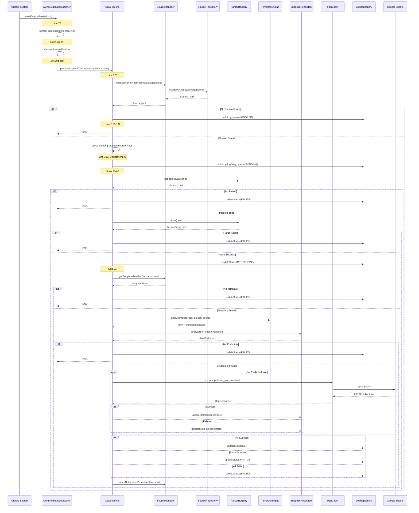
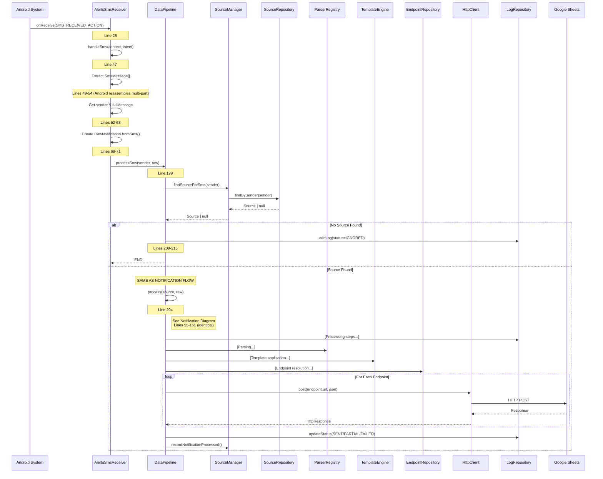
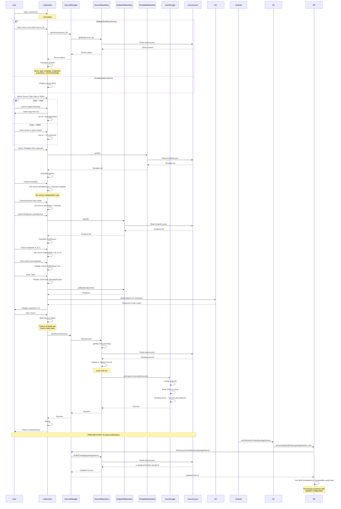
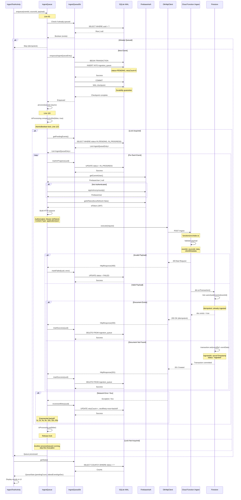
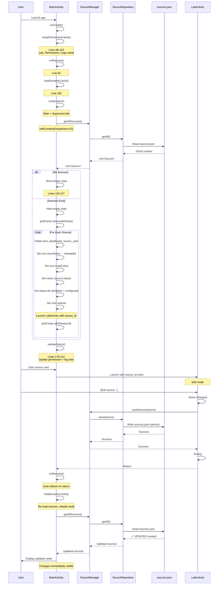

# AlertsToSheets Sequence Diagrams
**Generated:** 2025-12-23  
**Purpose:** Visual flow documentation for all runtime workflows

---

## 1. NOTIFICATION CAPTURE → DELIVERY



**Key Observations:**
- **Entry:** `AlertsNotificationListener.onNotificationPosted()` (Line 72)
- **Async Boundary:** `scope.launch` at Line 180 (switches to Dispatchers.IO)
- **Fan-out:** Loop at Line 125 sends to ALL configured endpoints
- **Partial Success:** Tracked with `anySuccess` and `allSuccess` flags
- **Logging:** LogEntry created at start (PENDING), updated throughout

---

## 2. SMS CAPTURE → DELIVERY



**Key Observations:**
- **Entry:** `AlertsSmsReceiver.onReceive()` (Line 28)
- **Convergence:** Both SMS and Notification paths call `DataPipeline.process()` (Line 55)
- **Multi-part SMS:** Android handles reassembly, `getMessagesFromIntent()` returns complete message
- **Same Delivery:** Uses identical endpoint fan-out and logging as notifications

---

## 3. LAB CARD CREATE/EDIT → PIPELINE EFFECTS



**Key Observations:**
- **Per-Source Configuration:** Each source has its own `templateJson`, `endpointIds`, `autoClean`
- **No Shared Templates:** Source gets a copy of template, not a reference
- **Atomic Write:** `JsonStorage.write()` uses temp file + rename
- **Immediate Effect:** Next notification uses updated source (file re-read on each notification)
- **Test Feature:** HTTP POST sent from LabActivity (separate from DataPipeline)

**Side Effect Timeline:**
1. User saves source → `sources.json` updated
2. Notification arrives → DataPipeline reads `sources.json` → finds updated source
3. Processing uses NEW config (template, endpoints, autoClean flags)

**Race Condition Window:**
- If notification arrives DURING source save → uses old data (coroutine captures source at start)
- Next notification → uses new data
- **Impact:** Expected behavior (eventual consistency)

---

## 4. FIRESTORE INGEST PIPELINE (MILESTONE 1 - NOT YET INTEGRATED)



**Key Observations:**
- **Entry:** `IngestQueue.enqueue()` (Line 92) - manual, NOT called by DataPipeline yet
- **Durability:** SQLite WAL + checkpoint after INSERT (Line 172)
- **Crash Recovery:** `recoverFromCrash()` marks `IN_PROGRESS` → `PENDING` on init (Line 99)
- **Concurrency:** AtomicBoolean lock prevents concurrent `processQueue()` (Line 123)
- **Idempotency:** Cloud Function checks `doc.exists` before write (Line 77)
- **Retry Logic:** Exponential backoff, max 7 retries (Line 50-56)
- **Isolation:** Separate from DataPipeline, no shared state

**NOT YET INTEGRATED:**
- DataPipeline.process() does NOT call IngestQueue.enqueue()
- Only accessible via IngestTestActivity (debug-only)
- Dual-write NOT implemented

---

## 5. DASHBOARD CARD LIFECYCLE



**Key Observations:**
- **Lazy Loading:** Sources loaded in `onResume()`, not `onCreate()`
- **Auto-Refresh:** Returning from LabActivity triggers `onResume()` → reload sources
- **Async Loading:** File I/O on Dispatchers.IO, UI updates on Main
- **No Caching:** Sources re-read from disk every time (ensures fresh data)
- **Empty State:** Handled gracefully (Lines 115-117)

---

## 6. SUMMARY: CONVERGENCE POINTS

### Single Choke Point: DataPipeline.process()

```
Entry Points                 Convergence              Delivery
────────────────────────────────────────────────────────────────
NotificationListener  ───┐
                         │
SMS Receiver         ───┼──→  DataPipeline.process()  ──→  Fan-out
                         │         (Line 55)                to ALL
[Email - Not Impl]   ───┘                                endpoints
```

**Implications:**
- ALL notification/SMS processing uses same code path
- Shared failure modes (parser, template, endpoint resolution)
- Shared resources (repositories, HttpClient, LogRepository)
- Concurrent notifications = concurrent coroutines (safe, isolated)

---

**END OF SEQUENCE DIAGRAMS**

