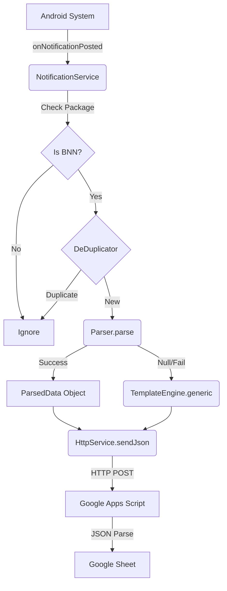

# Component Wiring

## Data Flow Diagram

## Connection Points

### 1. Manifest -> Service

- **File**: `AndroidManifest.xml`
- **Wiring**: The `<service>` tag must include the `BIND_NOTIFICATION_LISTENER_SERVICE` intent filter.
- **Permission**: `android.permission.BIND_NOTIFICATION_LISTENER_SERVICE`.

### 2. Service -> Parser

- **File**: `NotificationService.kt`
- **Call**: `val parsed = Parser.parse(fullContent)`
- **Logic**: The Service passes the raw `extras.getCharSequence("android.text")` (combined with title/lines) to the Parser.

### 3. Service -> Apps Script

- **File**: `HttpService.kt`
- **URL**: Configured as `const val SCRIPT_URL`.
- **Method**: POST.
- **Retry Logic**: None built-in (fire and forget), but runs in Coroutine to prevent main thread blocking.

### 4. Activity -> Service

- **File**: `AppConfigActivity.kt`
- **Interaction**: The Activity cannot directly control the Service (Android Security).
- **Testing**: The "Test Payload" button **bypasses** the Service listener and calls `Parser` -> `HttpService` logic directly within the Activity context to simulate a flow.
