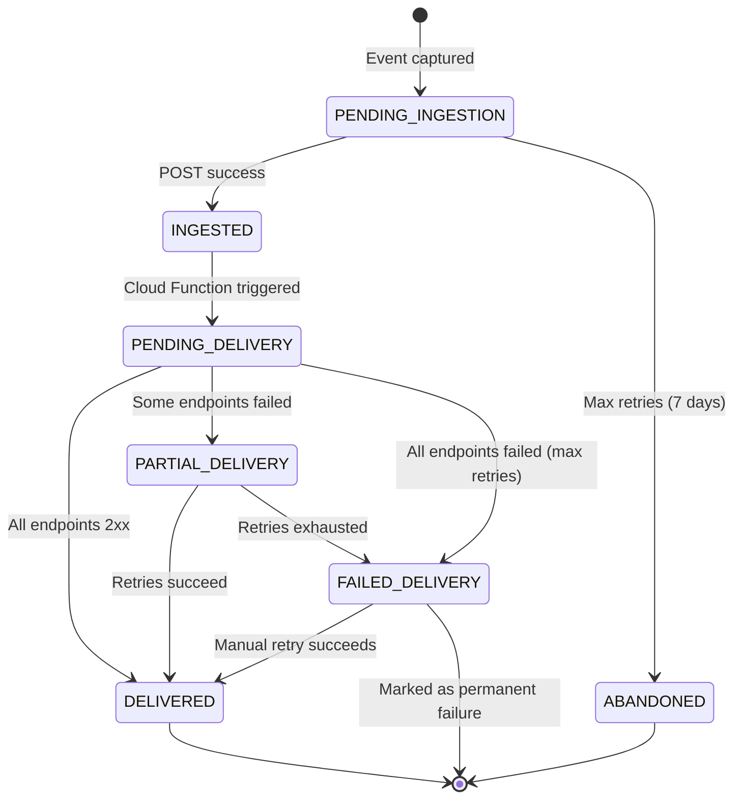

# PHASE 2 — DELIVERY DURABILITY (PERFORMANCE IN THE REAL WORLD)

**Date:** 2025-12-23  
**Project:** AlertsToSheets Android App  
**Context:** Building on Phase 1 canonical storage, designing failure-aware delivery

---

## PROMPT 2.1 — FAILURE-AWARE DELIVERY MODEL

### CURRENT DELIVERY FAILURE HANDLING (OBSERVED)

#### What Happens Today When Delivery Fails

**Scenario 1: Network timeout (15s)**
```
Current behavior:
1. HttpClient.post() times out after 15s
2. Exception caught in DataPipeline
3. Endpoint stats updated (failure count++)
4. LogEntry status → FAILED or PARTIAL
5. NO retry attempted

Result: Alert is lost
```

**Scenario 2: HTTP 500 from endpoint**
```
Current behavior:
1. HttpClient.post() returns 500
2. Logged as failed in DataPipeline
3. Endpoint stats updated (failure count++)
4. LogEntry status → FAILED or PARTIAL
5. NO retry attempted

Result: Alert is lost
```

**Scenario 3: App killed mid-delivery**
```
Current behavior:
1. DataPipeline coroutine is cancelled
2. Partial delivery may have occurred (some endpoints succeeded)
3. LogEntry may show PROCESSING (never updated to final status)
4. NO recovery on app restart (event not re-queued)

Result: Partial or complete data loss
```

**Scenario 4: Network unavailable**
```
Current behavior:
1. HttpClient.post() throws UnknownHostException
2. Exception caught in DataPipeline
3. NO queue, NO retry
4. LogEntry status → FAILED

Result: Alert is lost
```

###CRITICAL FINDING: Current system has NO retry for delivery failures

---

### PROPOSED FAILURE-AWARE DELIVERY MODEL

#### CORE PRINCIPLE: DELIVERY IS EVENTUAL, NOT IMMEDIATE

```
┌────────────────────────────────────────────────────────┐
│              DELIVERY STATE MACHINE                     │
└────────────────────────────────────────────────────────┘

1. PENDING_INGESTION
   ├─ Event captured on device
   ├─ Queued locally (SQLite)
   └─ Attempting POST to Firestore /ingest

2. INGESTED
   ├─ Firestore has accepted event
   ├─ Server returns 200 ACK
   ├─ Client deletes from local queue
   └─ Server triggers Cloud Function for delivery

3. PENDING_DELIVERY
   ├─ Cloud Function is processing
   ├─ Fan-out to ALL configured endpoints
   └─ Each endpoint delivery tracked independently

4. DELIVERED (terminal success)
   ├─ ALL endpoints returned 2xx status
   ├─ Delivery receipts written to Firestore
   └─ No further action needed

5. PARTIAL_DELIVERY (requires attention)
   ├─ SOME endpoints succeeded (2xx)
   ├─ SOME endpoints failed (timeout, 4xx, 5xx)
   ├─ Failed endpoints scheduled for retry
   └─ Admin alerted after N failed retries

6. FAILED_DELIVERY (terminal failure)
   ├─ ALL endpoints failed after max retries
   ├─ Admin alerted (critical notification)
   ├─ Event marked for manual intervention
   └─ Available for manual retry in admin UI
```

---

### SURVIVES APP RESTARTS ✅

**Challenge:** Android app can be killed at any time during delivery

**Solution:** Delivery happens SERVER-SIDE, not client-side

```
BEFORE (client-side delivery):
1. Client captures event
2. Client sends to ALL endpoints
3. If app killed → delivery stops, no recovery
❌ Data loss

AFTER (server-side delivery):
1. Client captures event
2. Client sends to Firestore (ingestion only)
3. Client receives ACK, deletes from local queue
4. Server triggers Cloud Function
5. Cloud Function delivers to all endpoints
6. Cloud Function retries failures
✅ App restart doesn't affect delivery
```

**Concrete lifecycle:**
```
Time T0: Event captured on device
Time T1: Event in local SQLite queue (PENDING_INGESTION)
Time T2: POST to Firestore
Time T3: Firestore ACK received
Time T4: Client deletes from SQLite (INGESTED)
--- APP CRASH HERE HAS NO EFFECT ---
Time T5: Cloud Function triggered by Firestore
Time T6: Fan-out delivery starts
Time T7: Delivery receipts written
Time T8: Status updated to DELIVERED or PARTIAL

If app crashes between T0-T4:
- Event still in SQLite queue
- On restart, queue processor retries POST
- No data loss

If app crashes after T4:
- Event already in Firestore (canonical)
- Server delivers independently
- No data loss
```

---

### SURVIVES NETWORK LOSS ✅

**Challenge:** Device may have no connectivity for hours

**Solution:** Client queues locally, server queues for delivery retries

```
CLIENT-SIDE (ingestion queue):
- SQLite queue holds events until ingestion succeeds
- Max queue size: 10,000 events (configurable)
- If queue full: drop oldest events (with alert to user)
- Retry backoff: 1s, 2s, 4s, 8s, 16s, 32s, 60s, 60s, ...
- Max retry duration: 7 days (configurable)
- After 7 days: mark as ABANDONED, alert user

SERVER-SIDE (delivery queue):
- Firestore holds ingested events
- Cloud Function retries failed deliveries
- Retry backoff: 1min, 5min, 15min, 1hr, 4hr, 12hr, 24hr
- Max retries: 10 (configurable)
- After max retries: mark as FAILED_DELIVERY, alert admin
```

**Concrete example:**
```
Scenario: Device offline for 12 hours

T0: Event captured, queued locally (PENDING_INGESTION)
T1-T720min: Device offline, queue holds event
T721min: Device online, POST to Firestore succeeds
T722min: Firestore triggers Cloud Function
T723min: Delivery completes

Result: Event delivered successfully, 12-hour delay
User sees: Activity Log shows event with delay
Admin sees: Ingestion latency spike in dashboard
```

---

### AVOIDS DUPLICATE SENDS ✅

**Challenge:** Retries can cause duplicates if not handled carefully

**Solution:** Idempotent ingestion + delivery receipts tracking

```
CLIENT-SIDE DEDUPLICATION:
1. Client generates UUID for each event (once, at capture time)
2. Client POSTs event with UUID
3. Client retries POST with SAME UUID if no ACK
4. Firestore checks if UUID exists before creating document
5. If exists, returns 200 (idempotent, no-op)
6. Client receives 200, deletes from queue
Result: Event ingested exactly once

SERVER-SIDE DEDUPLICATION:
1. Cloud Function reads event from Firestore
2. Cloud Function checks `deliveryReceipts` subcollection
3. For each endpoint:
   a. If receipt exists with 2xx status: skip (already delivered)
   b. If receipt exists with non-2xx: retry
   c. If no receipt: attempt delivery
4. Write receipt after each attempt (success or failure)
Result: Each endpoint receives event exactly once (unless retry logic)
```

**Edge case: Split-brain scenario**
```
Scenario: Client POSTs to Firestore, ACK is lost, client retries

T0: Client POST with UUID abc-123
T1: Firestore writes document (success)
T2: ACK packet lost on network
T3: Client times out, retries POST with UUID abc-123
T4: Firestore checks for existing UUID abc-123
T5: Found! Return 200 (no-op)
T6: Client receives 200, deletes from queue

Result: No duplicate ingestion, single delivery
```

---

### MAKES FAILURE VISIBLE ✅

**Challenge:** Silent failures are undetectable

**Solution:** Multi-level visibility with progressive escalation

```
LEVEL 1: USER VISIBILITY (Activity Log UI)
- Show every event with status
- PENDING_INGESTION → yellow dot
- INGESTED → blue dot
- DELIVERED → green dot
- PARTIAL_DELIVERY → orange dot
- FAILED_DELIVERY → red dot
- Tap event → show details (which endpoints failed, error messages)
- Long-press event → manual retry button

LEVEL 2: ENDPOINT HEALTH (Dashboard UI)
- Show per-endpoint metrics:
  - Success rate (last 24hr)
  - Avg response time (last 24hr)
  - Current status (UP, DEGRADED, DOWN)
  - Last failure time + error message
- Alert user if endpoint is DOWN for > 1 hour

LEVEL 3: ADMIN DASHBOARD (Web UI)
- System-wide metrics:
  - Ingestion rate (events/min)
  - Delivery success rate (%)
  - Queue depth (pending events)
  - Failed events count
  - Endpoint health grid
- Alerts:
  - High failure rate (>10% in 1 hour)
  - Queue backup (>1000 pending)
  - Critical endpoint down (>5% failure rate)

LEVEL 4: AUTOMATED ALERTS
- Email/SMS to admin when:
  - Any event reaches FAILED_DELIVERY
  - Endpoint failure rate >10% for >1 hour
  - Ingestion queue depth >5000
  - Server errors >50 in 1 hour
```

---

### BEHAVIOR, LIFECYCLE, STATE TRANSITIONS

#### STATE DIAGRAM



#### LIFECYCLE DETAILED

**Phase 1: PENDING_INGESTION** (client-side)
```
Entry: Event captured on device
Storage: SQLite queue
Retry logic: Exponential backoff (1s → 60s)
Max duration: 7 days
Exit conditions:
  - Success: Firestore returns 200 ACK → INGESTED
  - Failure: 7 days elapsed → ABANDONED
  - Intervention: User manually retries → restart
```

**Phase 2: INGESTED** (server-side, transient)
```
Entry: Firestore document created
Storage: Firestore `events` collection
Duration: Milliseconds (triggers Cloud Function immediately)
Exit: Cloud Function starts → PENDING_DELIVERY
```

**Phase 3: PENDING_DELIVERY** (server-side)
```
Entry: Cloud Function triggered
Storage: Firestore (status field)
Processing:
  - For each endpoint:
    a. Check existing receipts (skip if 2xx)
    b. POST payload
    c. Write receipt (status, time, error)
Exit conditions:
  - All endpoints 2xx → DELIVERED
  - Some endpoints failed → PARTIAL_DELIVERY
  - All endpoints failed (max retries) → FAILED_DELIVERY
```

**Phase 4: DELIVERED** (terminal success)
```
Entry: All endpoints returned 2xx
Storage: Firestore (status field + receipts)
Actions:
  - Update endpoint stats (increment success counters)
  - Clear from any retry queues
  - Notify client (if connected) to update Activity Log
```

**Phase 5: PARTIAL_DELIVERY** (requires attention)
```
Entry: Some endpoints succeeded, some failed
Storage: Firestore (status field + partial receipts)
Retry logic:
  - Failed endpoints scheduled for retry
  - Backoff: 1min, 5min, 15min, 1hr, 4hr, 12hr, 24hr
  - Max retries: 10
Actions:
  - Alert admin after 3 failed retries
  - Show orange dot in Activity Log
  - Manual retry available in admin UI
Exit conditions:
  - Retries succeed → DELIVERED
  - Max retries exhausted → FAILED_DELIVERY
```

**Phase 6: FAILED_DELIVERY** (terminal failure)
```
Entry: All endpoints failed after max retries
Storage: Firestore (status field + all failed receipts)
Actions:
  - Alert admin (email, SMS, push notification)
  - Show red dot in Activity Log
  - Disable auto-retry (prevent spam)
  - Manual retry button in admin UI
Exit conditions:
  - Admin manually retries → back to PENDING_DELIVERY
  - Admin marks as permanent failure → archive
```

---

### FOCUS: BEHAVIOR, NOT IMPLEMENTATION DETAILS

**Key behaviors:**
1. **Durability:** Events survive app crashes, network loss, server downtime
2. **Visibility:** Every failure is logged and surfaces to user/admin
3. **Retry:** Automatic with exponential backoff, configurable limits
4. **Idempotency:** Safe to retry without creating duplicates
5. **Isolation:** One endpoint's failure doesn't block others
6. **Escalation:** Persistent failures alert humans for intervention

**NOT specifying:**
- Exact retry intervals (configurable)
- Exact max retries (configurable)
- Exact queue sizes (configurable)
- Exact alert thresholds (configurable)
- Implementation language/framework (Cloud Functions, Lambda, etc.)

---

## PROMPT 2.2 — RETRY & BACKOFF PHILOSOPHY

### EMERGENCY-ALERT WORKLOAD CHARACTERISTICS

```
Typical patterns:
- Burst traffic: 50+ alerts in 5 minutes (major incident)
- Flaky connectivity: Rural cell towers, congested networks
- Endpoint downtime: Google Sheets maintenance, webhook timeouts
- Time sensitivity: Alerts lose value after 15 minutes

Requirements:
- Fast retry for transient failures (DNS glitch, momentary packet loss)
- Slow retry for persistent failures (endpoint maintenance, long outage)
- Give up eventually (don't retry forever, alert humans)
- Don't overwhelm endpoints (respect rate limits, avoid thundering herd)
```

---

### RECOMMENDED RETRY STRATEGY (CLIENT-SIDE)

**Context:** Client trying to ingest event to Firestore

```javascript
Failure types:
1. Network timeout (device offline)
   → Retry aggressively (user may be moving into coverage)
   
2. DNS failure (cannot resolve firestore.googleapis.com)
   → Retry aggressively (DNS is usually fast to recover)
   
3. HTTP 500 (Firestore internal error)
   → Retry moderately (Firestore may be deploying)
   
4. HTTP 429 (rate limit)
   → Back off significantly (client is too aggressive)
   
5. HTTP 400 (bad request)
   → DO NOT RETRY (client bug, fix required)
   
6. HTTP 401 (unauthorized)
   → DO NOT RETRY (auth issue, user intervention required)
```

**Backoff schedule:**
```
Attempt  | Delay     | Cumulative Time | Rationale
---------|-----------|-----------------|----------
1        | 0s        | 0s              | Immediate (transient glitches)
2        | 1s        | 1s              | Quick retry (DNS, brief drop)
3        | 2s        | 3s              | Network recovery time
4        | 4s        | 7s              | Still fast enough for UX
5        | 8s        | 15s             | User may notice delay
6        | 16s       | 31s             | Approaching user timeout
7        | 32s       | 63s             | Long but acceptable
8-N      | 60s       | 2min+           | Steady state until success

Max duration: 7 days (604,800 seconds)
Max queue size: 10,000 events

After 7 days: Mark as ABANDONED, alert user
After queue full: Drop oldest events, alert user
```

**Jitter:** Add ±20% random jitter to prevent thundering herd
```javascript
actualDelay = baseDelay * (0.8 + Math.random() * 0.4)
```

---

### RECOMMENDED RETRY STRATEGY (SERVER-SIDE)

**Context:** Cloud Function trying to deliver event to endpoint

```javascript
Failure types:
1. Network timeout (endpoint slow/unresponsive)
   → Retry moderately (endpoint may be overloaded)
   
2. HTTP 500 (endpoint internal error)
   → Retry moderately (endpoint may be deploying)
   
3. HTTP 502/503/504 (gateway errors)
   → Retry aggressively (load balancer issue, fast recovery)
   
4. HTTP 429 (rate limit)
   → Back off significantly (respect endpoint limits)
   
5. HTTP 400/422 (bad request)
   → DO NOT RETRY (data/schema issue, fix required)
   
6. HTTP 401/403 (auth)
   → DO NOT RETRY (credentials issue, fix required)
   
7. HTTP 2xx (success)
   → Done, no retry
```

**Backoff schedule:**
```
Attempt  | Delay     | Cumulative Time | Rationale
---------|-----------|-----------------|----------
1        | 0s        | 0s              | Immediate (Cloud Function trigger)
2        | 1min      | 1min            | Fast retry (transient errors)
3        | 5min      | 6min            | Endpoint may be restarting
4        | 15min     | 21min           | Longer outage suspected
5        | 1hr       | 1hr 21min       | Major incident suspected
6        | 4hr       | 5hr 21min       | Extended maintenance
7        | 12hr      | 17hr 21min      | Multi-hour outage
8        | 24hr      | 41hr 21min      | Multi-day outage
9        | 24hr      | 65hr 21min      | Still trying...
10       | 24hr      | 89hr 21min      | Last attempt

Max retries: 10
After max retries: Mark as FAILED_DELIVERY, alert admin
```

**Jitter:** Add ±10% random jitter (less than client-side, since server is more stable)

---

### BURST TRAFFIC HANDLING

**Challenge:** 50 alerts in 5 minutes overwhelms endpoints

**Solution 1: Client-side rate limiting**
```javascript
// Limit ingestion rate to prevent queue overflow
const MAX_INGESTION_RATE = 10 events/second

if (queueSize > 1000 && ingestionRate > MAX_INGESTION_RATE) {
  // Slow down capture (buffer in memory briefly)
  await delay(100ms)
}
```

**Solution 2: Server-side batching**
```javascript
// Cloud Function batches events to same endpoint
const BATCH_SIZE = 10
const BATCH_WINDOW = 5 seconds

// Instead of 50 individual POSTs, send 5 batches of 10
await endpoint.postBatch(events)
```

**Solution 3: Endpoint-specific throttling**
```javascript
// Respect known rate limits per endpoint
const SHEETS_RATE_LIMIT = 60 requests/minute

if (endpoint.type === 'google-sheets') {
  await rateLimiter.wait() // Ensures <60/min
}
```

---

### FLAKY CONNECTIVITY HANDLING

**Challenge:** Rural cell towers drop packets randomly

**Solution:** Aggressive early retries, then back off

```javascript
// Fast retries for first 30 seconds (likely transient)
if (attemptNumber <= 5) {
  delay = Math.pow(2, attemptNumber - 1) // 1s, 2s, 4s, 8s, 16s
}
// Steady-state retries after (likely persistent)
else {
  delay = 60s
}
```

**Why:** Flaky networks often recover within seconds. Fast retries increase chances of success before user loses cell signal entirely.

---

### ENDPOINT DOWNTIME HANDLING

**Challenge:** Google Sheets maintenance for 4 hours

**Solution:** Long retries with admin alerts

```javascript
// After 3 failed delivery attempts (21 minutes):
alertAdmin({
  severity: 'WARNING',
  message: 'Endpoint "Sheets Primary" failing for 21 minutes',
  endpoint: endpoint.id,
  failureRate: '100%',
  lastError: 'HTTP 503 Service Unavailable'
})

// After 5 failed attempts (1hr 21min):
alertAdmin({
  severity: 'CRITICAL',
  message: 'Endpoint "Sheets Primary" DOWN for 1+ hour',
  suggestion: 'Check endpoint status, consider fallback'
})

// Continue retrying up to 10 attempts (89 hours)
// This survives multi-day outages without data loss
```

---

### OBSERVABILITY SIGNALS

**For debugging failures in the field:**

#### 1. Ingestion Queue Depth (client-side)
```javascript
Metrics:
- queueSize: Number of events pending ingestion
- oldestEventAge: Seconds since oldest event was captured
- ingestionRate: Events/second successfully ingested
- failureRate: % of POST attempts that failed

Alerts:
- queueSize > 1000 → User notification ("Network slow, queue building")
- oldestEventAge > 3600 → User notification ("Network down for 1+ hour")
- queueSize > 5000 → Critical user alert ("Risk of data loss")
```

#### 2. Delivery Success Rate (server-side)
```javascript
Metrics (per endpoint, per 1-hour window):
- totalAttempts: Number of delivery attempts
- successCount: Number of 2xx responses
- failureCount: Number of non-2xx responses
- avgResponseTime: Mean milliseconds per request
- p95ResponseTime: 95th percentile response time

Alerts:
- successRate < 90% → Warning ("Endpoint degraded")
- successRate < 50% → Critical ("Endpoint down")
- avgResponseTime > 5000ms → Warning ("Endpoint slow")
```

#### 3. Retry Exhaustion Rate (server-side)
```javascript
Metrics (per 24-hour window):
- eventsIngested: Total events received
- eventsDelivered: Events that reached DELIVERED status
- eventsPartial: Events stuck in PARTIAL_DELIVERY
- eventsFailed: Events that reached FAILED_DELIVERY

Alerts:
- eventsFailed > 0 → Critical ("Data loss occurred")
- eventsPartial > 10 → Warning ("Delivery issues")
- (eventsFailed / eventsIngested) > 1% → Critical ("High failure rate")
```

#### 4. Endpoint Health Score (computed)
```javascript
Health score = (successRate * 0.5) + 
               (1 / avgResponseTime * 0.3) + 
               (uptimeRate * 0.2)

Where:
- successRate = successCount / totalAttempts (last 24hr)
- avgResponseTime = mean response time (last 24hr), normalized
- uptimeRate = % of time endpoint was reachable (last 7 days)

Display:
- 90-100: Green "Healthy"
- 70-89: Yellow "Degraded"
- 0-69: Red "Down"
```

---

### LIMITS & OBSERVABILITY SUMMARY

| Limit Type | Client-Side | Server-Side |
|------------|-------------|-------------|
| **Max retries** | Unlimited (7 days) | 10 attempts |
| **Max backoff** | 60 seconds | 24 hours |
| **Max queue** | 10,000 events | Unlimited (Firestore) |
| **Rate limit** | 10 events/sec | Per-endpoint config |
| **Timeout** | 15 seconds | 30 seconds |
| **Batch size** | 1 (no batching) | 10 events (optional) |

| Observability Signal | Where | Threshold | Action |
|---------------------|-------|-----------|--------|
| Queue depth | Client | >1000 | Notify user |
| Oldest event age | Client | >1hr | Notify user |
| Endpoint success rate | Server | <90% | Alert admin |
| Delivery failure rate | Server | >1% | Alert admin |
| Retry exhaustion | Server | >0 | Alert admin (critical) |
| Endpoint response time | Server | >5s | Alert admin |

---

## SUMMARY

**CURRENT STATE:**
- No retry on delivery failure → data loss
- No observability → silent failures
- No backpressure → queue overflow on burst traffic

**PROPOSED STATE:**
- Client: Aggressive retry (1s → 60s) for ingestion, 7-day durability
- Server: Moderate retry (1min → 24hr) for delivery, 10-attempt limit
- Observability: Queue depth, success rate, failure rate, response time
- Alerts: Progressive escalation (user → admin → critical)
- Backpressure: Rate limiting, batching, endpoint-specific throttling

**PHILOSOPHY:**
- Optimize for zero data loss
- Retry aggressively for transient failures
- Back off for persistent failures
- Alert humans when automation fails
- Make all failures visible

---

**NEXT PHASE:** Define fanout responsibility split (PHASE 3)

