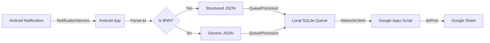

# System Handoff & Architecture

**Project**: Alerts to Sheets  
**Goal**: Intercept Android notifications (specifically BNN), parse them into structured data, and sync them to a Google Sheet in real-time.

---

## System Architecture



### Key Components

1. **Android App (`/android`)**
   - **NotificationService**: Runs as a Foreground Service to listen 24/7.
   - **Parser**: "Brain" of the operation. Splits pipe-delimited text.
   - **QueueSystem**: Ensures zero data loss. If offline, requests stay in SQLite.
   - **Dashboard**: Status dots indicate health of Permissions, Listeners, and Queue.

2. **Google Apps Script (`/scripts`)**
   - **Web App Endpoint**: Receives POST requests.
   - **Logic**: Handles Deduplication (ID Check), Row Appending (Updates), and formatting.

3. **Google Sheet**
   - **Columns**: Status | Time | ID | State | County | City | Address | Type | Details | Original | FD Codes...

---

## Build & Install

### Prerequisites
- **JDK 17** (Required for AGP 8.2+).
- **Android Studio** (Open `android/` folder, NOT root).

### Steps

1. **Clone**: `git clone ...`
2. **Open**: Open `android/` directory in Android Studio.
3. **Config**: Ensure `google-services.json` is in `android/app/`.
4. **Build**:
   ```bash
   cd android
   .\gradlew.bat :app:assembleDebug --no-daemon
   ```
5. **Install**: Connect phone, enable USB Debugging, run via Studio or:
   ```bash
   .\gradlew.bat :app:installDebug --no-daemon
   ```

### Known Issues (Windows)
- **File Locks**: if `.\gradlew clean` fails with `R.jar` locked:
  - **Fix**: Kill `java.exe` processes or Restart Android Studio.
  - **Prevent**: Add Defender exclusions for `.gradle` and `build/`.

---

## Troubleshooting

### "Two App Icons"
If you see two launchers:
1. Check `AndroidManifest.xml`. Only `MainActivity` should have `<category android:name="android.intent.category.LAUNCHER" />`.
2. Ensure you don't have a "Debug" and "Release" build installed simultaneously (applicationId suffix).
3. Uninstall all variants and perform a fresh clean install.

### Notifications Not Sending
1. **Check Dashboard**: Are all dots GREEN?
2. **Check Permissions**: Toggle "Notification Listener" off/on.
3. **Check Logs**: Go to "Logs" in app. Red means backend failure.
4. **Check Queue**: If logs are stuck "Pending", check internet.

### "Pending" Stuck
- The system now waits for HTTP 200 OK. If Apps Script fails or times out, status remains Pending.
- Verify Web App URL in `EndpointActivity`.

---

## Key Files

| File | Purpose |
|------|---------|
| `NotificationService.kt` | Listens for notifications, routes to parser |
| `Parser.kt` | Parses BNN pipe-delimited format |
| `QueueProcessor.kt` | Offline persistence and retry logic |
| `NetworkClient.kt` | HTTP POST to Google Apps Script |
| `scripts/Code.gs` | Google Apps Script doPost handler |
| `ParsedData.kt` | Data model for parsed BNN notifications |

---

## Data Flow

```
1. BNN App sends notification
   ↓
2. NotificationService intercepts (onNotificationPosted)
   ↓
3. Checks if BNN (package name or "<C> BNN" marker)
   ↓
4. Parser.parse(fullContent) → ParsedData object
   ↓
5. Serialize to JSON (matches Apps Script schema)
   ↓
6. QueueProcessor.enqueue(url, json)
   ↓
7. SQLite persistence (survives app restart)
   ↓
8. NetworkClient.send(url, json)
   ↓
9. Apps Script doPost(e) receives JSON
   ↓
10. Searches for existing incidentId in Column C
    ├─ Found: Append to existing row (Update)
    └─ Not Found: Create new row (New Incident)
   ↓
11. Google Sheet updated with all fields
```

---

## Permissions Required

1. **Notification Listener**: `android.permission.BIND_NOTIFICATION_LISTENER_SERVICE`
2. **Internet**: `android.permission.INTERNET`
3. **SMS** (optional): `android.permission.RECEIVE_SMS`
4. **Battery Optimization**: Request ignore for 24/7 operation

---

## Testing

### Manual Test Flow
1. Open app → Check dashboard (all dots green)
2. Go to "Payloads" → Tap "Test Payload Now"
3. Check Google Sheet for new row with all columns filled
4. Send same incidentId again → Verify row updates (appends)

### Log Monitoring
```powershell
adb logcat | findstr "NotificationService Parser BNN"
```

---

## Deployment

### Debug Build (Development)
```powershell
cd android
.\gradlew.bat :app:assembleDebug --no-daemon
adb install app/build/outputs/apk/debug/app-debug.apk
```

### Release Build (Production)
```powershell
.\gradlew.bat :app:assembleRelease --no-daemon
# Sign APK with release keystore
# Upload to distribution channel
```

---

## Support

For issues, consult:
- `/docs/architecture/DIAGNOSTICS.md` - Debugging procedures
- `/docs/architecture/parsing.md` - BNN parsing specification
- `/docs/tasks/` - Current active bugs/features

